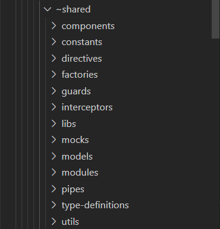
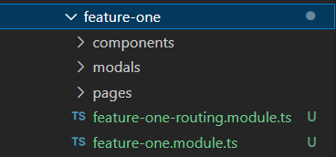
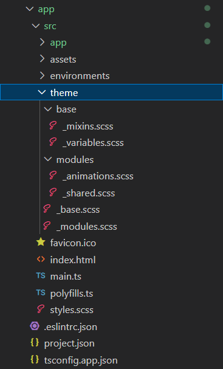

## Dossier @shared

- ***components***: Regroupe, les composants partagées de l'application.

  Quand ils deviennent plus nombreux, les composants sont regroupés par thématiques dans des sous-dossiers.
  Ex: `modals/...`, `fields/...`, etc.

- ***mocks***: Regroupe, les services/fichiers de mocks.

- ***utils***: Regroupe, les fonctions partagées de l'application.

  Par défaut, les fonctions sont créés dans le fichier `utils.ts`, puis regroupéés par thématiques, quand elles deviennent plus nombreuses.
  Ex: `date.utils.ts`, `forms.utils.ts`, `rxjs.utils.ts`, etc.

- ***libs***: Regroupe les librairies tierces à importer.

- ***type-definitions***: Regroupe les définitions de type.

## Dossier @shared (ou ~shared)

- ***actions***: Fichiers d'action
- ***facades***: Pages du module
- ***states***: Modals et popups du module

## Feature modules

Les composants sont organisés dans 3 dossiers pricipaux:

- ***components***: composants du module
- ***pages***: Pages du module
- ***modals***: Modals et popups du module

## Dossier Theme

