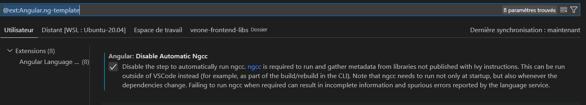
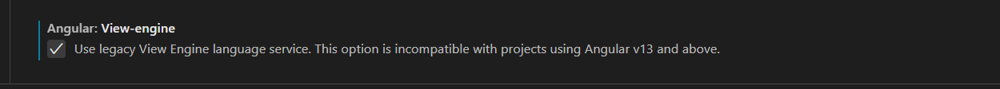

## IDE

L'IDE récommandé pour les développements frontend est **Visual studio code**.

Si vous rencontrez des problèmes de compilations au lancement du serveur de développement, veillez à installer l'extensions **Angular language service** et à activer les paramêtres suivants :

## Angular Style

Veillez à respecter les recommandations d'Angular [Angular Style Guide](https://angular.io/guide/styleguide).

Quelques exemples:

- camelCase pour les variables --> `aNewVariable` et fonctions `addNewElement()`
- PascalCase pour les Services --> `AuthService`, classes --> `Authenticator` et composants `AuthComponent`.
- KebabCase pour les attributs html --> `<a id='home-link' class='home-link'>Home</a>`
- Upper Case Snake Case pour les constantes globales i.e `AUTHENTICATION_TYPES`

Quelques Références:

- [Règles de nommage](https://deviq.com/naming-things/)