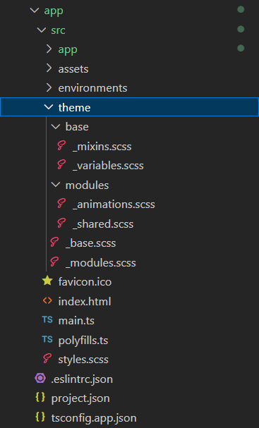

## IDE

Dans les projets Angular, l'architecture est définie comme suit:

- **Un dossier @shared (ou ~shared)**.
- **Un dossier @store (ou ~store)**.
- **Les feature modules**.

- **Un dossier theme à la racine du projet**.

## Dossier @shared (ou ~shared)

Ce dossier regroupe, tout les éléments partagés (composants, directives, services, modules, etc) par les différents Features modules (y compris les modules core et shared).
Tout composant utilisé dans au moins 2 feature modules, doit figurer ou être déplacé dans ce dossier.

Les services, pipes et directives, sont toujours définies dans ce dossier, même si elle ne sont chargées que dans 1 seul feature module.

## Dossier @store (ou ~store)

Contient toute la logique, des états (states), et facades associées.

## Feature modules

Comporte tout les composants, d'un ensemble de fonctionnalités.

Dans chaque dossier, doit uniquement figurer les fichiers de composants (pages, et petites entités), module, et classe de routing de la feature.

## Dossier theme

Contient les styles globaux, styles partagés, et modifications de librairies CSS.
